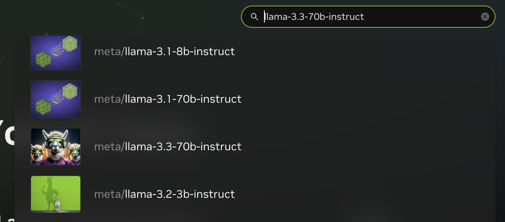
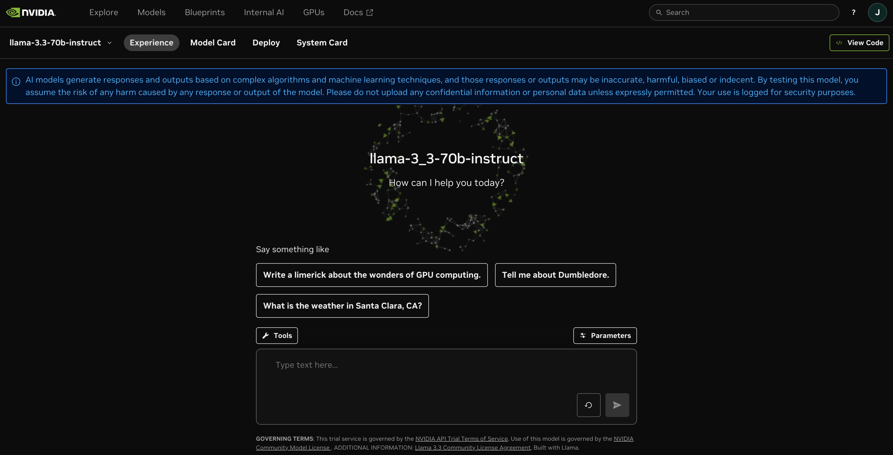
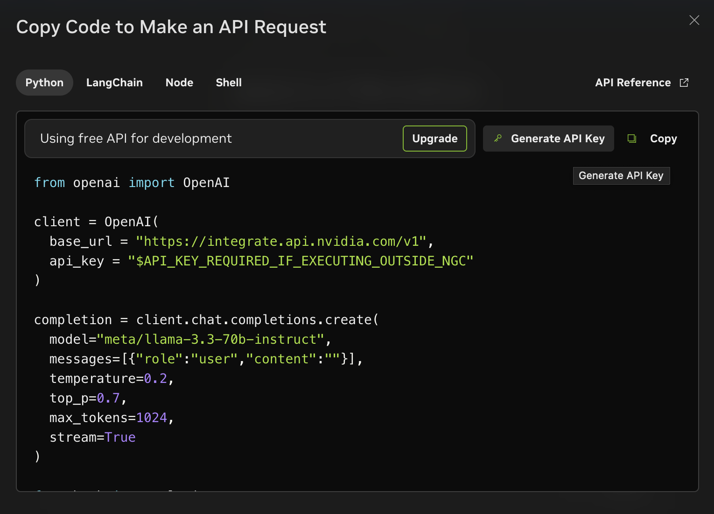

# API Keys
## NVIDIA API Key
You will need an NVIDIA API KEY to call NVIDIA AI Endpoints.  

You can use different model API endpoints with the same API key, so even if you change the LLM specification in `ChatNVIDIA(model=llm_model)` you can still use the same API KEY.

a. Navigate to [https://build.nvidia.com/](https://build.nvidia.com/).

b. Search for **llama-3.3-70b-instruct**  and click the entry. You can also find any other llm for generating the key since it is shared across all NIMs.

c. You should now be in the NIM page.

d. Click "View Code" on the top right corner of the page.

e. Click **Generate API Key** in the window that pops up.

Log in if you haven't already.

d. Copy your generated API key to a secure location. We will be using it in this blueprint.
